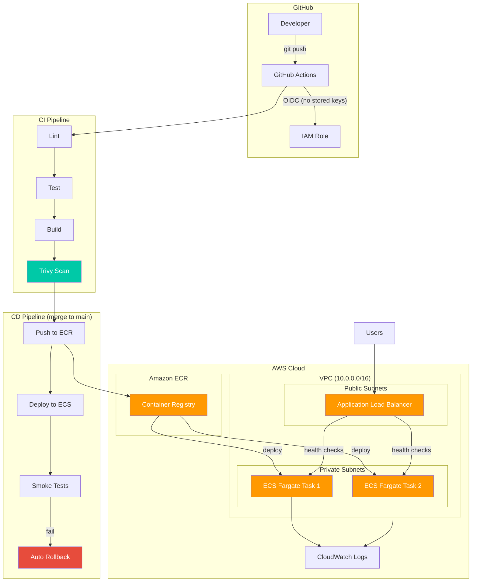

# CI/CD pipeline with Security gates

[](https://github.com/tani-mani-meow/CI-CD-pipeline-with-Security-gates/actions/workflows/ci.yml)
[](https://github.com/tani-mani-meow/CI-CD-pipeline-with-Security-gates/actions/workflows/terraform.yml)
[](https://github.com/tani-mani-meow/CI-CD-pipeline-with-Security-gates/actions/workflows/codeql.yml)
[]()
[](https://opensource.org/licenses/MIT)

A **production-grade CI/CD pipeline** deploying a Dockerised Node.js application to **AWS ECS Fargate**, with infrastructure managed by **Terraform**. Features every stage a real company would have: build, test, security scan, push to ECR, deploy, verify — with **automatic rollback on failure**.


## Table of Contents

- [Architecture](#architecture)
- [Project Structure](#project-structure)
- [Prerequisites](#prerequisites)
- [First Deploy](#first-deploy)
- [Terraform Infrastructure](#terraform-infrastructure)
- [Security Features](#security-features)
- [Deployment Strategy](#deployment-strategy)
- [Rollback](#rollback)
- [License](#license)

---

## Architecture



**Key Design Decisions:**

| Decision | Rationale |
|----------|-----------|
| OIDC authentication | No stored AWS keys — short-lived tokens via federation |
| ECR with scan-on-push | Double scanning: Trivy in CI + ECR native scanning |
| Fargate (serverless) | No EC2 instances to manage, patch, or scale |
| Private subnets for ECS | Containers never exposed directly to the internet |
| Deployment circuit breaker | AWS-native auto-rollback when tasks fail to stabilise |
| Terraform modules | Reusable, testable, environment-agnostic infrastructure |
| Split CI/CD workflows | PRs run checks only; merges trigger deploy — clean separation |

---

## Project Structure

```
.
├── .github/workflows/
│   ├── ci.yml               # CI: lint, test, build, security scan (PR + develop)
│   ├── deploy.yml           # CD: push, deploy, verify, rollback (push to main)
│   ├── terraform.yml        # Terraform plan/apply (PR + push, terraform/**)
│   ├── rollback.yml         # Manual ECS rollback (workflow_dispatch)
│   ├── destroy.yml          # Infrastructure teardown (workflow_dispatch)
│   └── codeql.yml           # CodeQL analysis (push, PR, weekly schedule)
├── terraform/
│   ├── main.tf              # Root module — wires modules together
│   ├── variables.tf         # Input variables
│   ├── outputs.tf           # Exported values (ALB URL, ECR URI)
│   ├── providers.tf         # AWS provider config
│   ├── backend.tf           # S3 remote state
│   ├── backend.example.tf   # Example backend config with placeholders
│   ├── data.tf              # Data sources
│   ├── terraform.tfvars.example
│   └── modules/
│       ├── vpc/             # VPC, subnets, NAT, IGW
│       ├── ecr/             # ECR repo, lifecycle, scanning
│       ├── alb/             # ALB, target group, health checks
│       ├── ecs/             # Cluster, task def, service, auto-scaling
│       └── iam/             # OIDC provider, GitHub role, ECS roles
├── src/
│   ├── app.js               # Express app (Helmet, CORS, error handling)
│   ├── server.js            # Entry point (graceful shutdown)
│   ├── routes/health.js     # /health, /ready, /api/info, /api/metrics
│   └── middleware/logger.js # Structured JSON request logging
├── tests/
│   ├── unit/app.test.js     # Unit tests (Jest)
│   └── integration/health.test.js  # Integration tests (Supertest)
├── scripts/
│   ├── bootstrap-state.sh   # One-time S3 + DynamoDB setup
│   ├── smoke-test.sh        # Post-deploy verification
│   └── rollback.sh          # Rollback helper
├── Dockerfile               # Multi-stage, non-root, Alpine
├── docker-compose.yml       # Local development
├── docker-compose.prod.yml  # Production (ECR image reference)
└── package.json
```

---

## Prerequisites

- **AWS Account** with admin access (for initial setup)
- **AWS CLI** v2 configured locally
- **Terraform** >= 1.5
- **Node.js** >= 22 (for local development)
- **Docker** (for local development)

---

## First Deploy

This guide walks through deploying the full stack on a fresh AWS account. Estimated time: **20-30 minutes**.

### Step 1: Clone and install

```bash
git clone https://github.com/tani-mani-meow/cicd-pipeline.git
cd cicd-pipeline
npm ci
npm test          # verify everything works locally
```

### Step 2: Bootstrap Terraform state backend

Terraform needs an S3 bucket for state and a DynamoDB table for locking. Run the bootstrap script once:

```bash
chmod +x scripts/bootstrap-state.sh
./scripts/bootstrap-state.sh us-east-1
```

This creates:
- S3 bucket: `cicd-pipeline-terraform-state-<random-suffix>`
- DynamoDB table: `cicd-pipeline-terraform-locks`

### Step 3: Configure Terraform

```bash
cd terraform
cp terraform.tfvars.example terraform.tfvars
```

Edit `terraform.tfvars` — set `github_repository` to your repository name (e.g., `"tani-mani-meow/cicd-pipeline"`).

If your S3 bucket from Step 2 has a different name, update `backend.tf` with the actual bucket and table name. Or use `backend.example.tf` as a starting point.

### Step 4: Deploy infrastructure

```bash
terraform init
terraform plan      # review the changes
terraform apply     # type 'yes' to confirm
```

After apply completes, take note of the outputs:

```bash
terraform output github_actions_role_arn    # → set as GitHub secret: AWS_ROLE_ARN
terraform output ecr_repository_url         # → set as GitHub variable: ECR_REPOSITORY
```

### Step 5: Configure GitHub repository

Navigate to your repo → Settings → Secrets and variables → Actions:

**Secrets:**
| Name | Value |
|------|-------|
| `AWS_ROLE_ARN` | From `terraform output github_actions_role_arn` |

**Variables:**
| Name | Value |
|------|-------|
| `AWS_REGION` | `us-east-1` |
| `ECR_REPOSITORY` | From `terraform output ecr_repository_url` (extract the repo name) |
| `ECS_CLUSTER` | `cicd-pipeline-staging` |
| `ECS_SERVICE` | `cicd-pipeline-staging` |
| `TASK_FAMILY` | `cicd-pipeline-staging` |

### Step 6: Push code

```bash
# Push to develop → CI runs (lint, test, build, security scan)
git push origin develop

# Merge to main → CD runs (push ECR, deploy, verify)
git push origin main
```

### Step 7: Verify deployment

```bash
# Get the ALB URL
aws elbv2 describe-load-balancers \
  --query "LoadBalancers[?contains(LoadBalancerName, 'cicd-pipeline')].DNSName" \
  --output text

# Test health endpoint
curl http://<alb-dns>/health
```

Expected response:
```json
{"status":"ok","uptime":42,"timestamp":"2026-01-01T00:00:00.000Z","version":"1.0.0"}
```

### Local Development

```bash
npm run dev                           # Node.js with file watching
docker compose up -d                  # Docker (local)
curl http://localhost:3000/health     # Test
```

---

## Terraform Infrastructure

### AWS Resources Provisioned

| Resource | Module | Purpose |
|----------|--------|---------|
| VPC + Subnets | `vpc` | Isolated network (2 public + 2 private AZs) |
| Internet Gateway | `vpc` | Public subnet internet access |
| NAT Gateway | `vpc` | Private subnet → internet (ECR image pulls) |
| ECR Repository | `ecr` | Private container registry with scanning |
| ALB | `alb` | Public load balancer with health checks |
| ECS Cluster | `ecs` | Fargate serverless cluster |
| ECS Service | `ecs` | Running tasks with circuit breaker |
| Auto Scaling | `ecs` | CPU-based scaling (2-4 tasks) |
| CloudWatch Logs | `ecs` | Container log aggregation (30-day retention) |
| OIDC Provider | `iam` | GitHub Actions federation |
| IAM Roles | `iam` | Execution, task, and CI/CD roles |

### Terraform Workflow

```
PR opened (terraform/**) → terraform plan → plan posted as PR comment
PR merged to main        → terraform apply → infrastructure updated
```

---

## Security Features

| Feature | Implementation |
|---------|---------------|
| **No stored AWS keys** | GitHub OIDC → short-lived STS tokens |
| **Container scanning** | Trivy in CI + ECR scan-on-push |
| **Dockerfile linting** | Hadolint best practice enforcement |
| **SARIF audit trail** | Scan results in GitHub Security tab |
| **CodeQL analysis** | GitHub-native code scanning (JS/TS) |
| **SHA-pinned actions** | Immutable CI/CD dependencies |
| **Harden Runner** | Egress audit on every CI job |
| **Private subnets** | ECS tasks never exposed to internet |
| **Non-root container** | App runs as `node` user |
| **Security headers** | Helmet.js (XSS, HSTS, CSP) |
| **Least privilege IAM** | Scoped roles for each component |
| **Encrypted state** | S3 + KMS for Terraform state |
| **State locking** | DynamoDB prevents concurrent changes |

---

## Deployment Strategy

### Automatic (CI/CD Pipeline)

```
push to develop → CI runs (lint, test, build, scan) — no deploy
push to main    → CI runs → CD runs (push ECR, deploy ECS, verify, rollback on fail)
```

### Rollback Mechanisms

| Mechanism | Trigger | Scope |
|-----------|---------|-------|
| **ECS Circuit Breaker** | Tasks fail to start/stabilise | Automatic |
| **Pipeline Rollback** | Smoke tests fail | Automatic |
| **Manual Rollback** | `workflow_dispatch` | Operator-triggered |

---

## Rollback

### Automatic

The ECS deployment circuit breaker automatically reverts to the previous stable task definition if new tasks fail health checks. Additionally, the pipeline's rollback job runs `ecs update-service` with the previous task ARN when smoke tests fail.

### Manual

1. Go to **Actions** → **Manual Rollback**
2. Enter the task definition revision number
3. Select environment → Run

```bash
# Find available revisions
aws ecs list-task-definitions --family-prefix cicd-pipeline-staging --sort DESC
```

---

## License

MIT — see [LICENSE](LICENSE).

---

<p align="center">
  Built by Tanishq Ingawale
</p>


